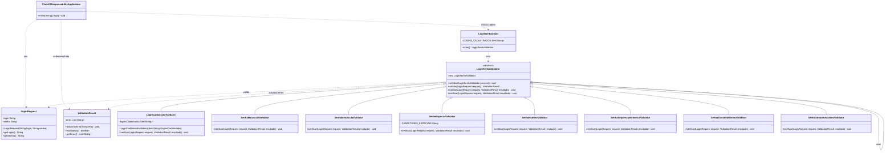

# UML - Chain of Responsibility

```mermaid
classDiagram
    class ChainOfResponsabilityApplication {
        +main(String[] args) void
    }

    class LoginSenhaChain {
        -LOGINS_CADASTRADOS Set~String~
        +criar() LoginSenhaValidator
    }

    class LoginRequest {
        -login String
        -senha String
        +LoginRequest(String login, String senha)
        +getLogin() String
        +getSenha() String
    }

    class ValidationResult {
        -erros List~String~
        +adicionarErro(String erro) void
        +estaValido() boolean
        +getErros() List~String~
    }

    class LoginSenhaValidator {
        <<abstract>>
        -next LoginSenhaValidator
        +setNext(LoginSenhaValidator proximo) void
        +validar(LoginRequest request) ValidationResult
        #validar(LoginRequest request, ValidationResult resultado) void
        #verificar(LoginRequest request, ValidationResult resultado) void*
    }

    class LoginCadastradoValidator {
        -loginsCadastrados Set~String~
        +LoginCadastradoValidator(Set~String~ loginsCadastrados)
        #verificar(LoginRequest request, ValidationResult resultado) void
    }

    class SenhaMaiusculaValidator {
        #verificar(LoginRequest request, ValidationResult resultado) void
    }

    class SenhaMinusculaValidator {
        #verificar(LoginRequest request, ValidationResult resultado) void
    }

    class SenhaEspecialValidator {
        -CARACTERES_ESPECIAIS String
        #verificar(LoginRequest request, ValidationResult resultado) void
    }

    class SenhaNumeroValidator {
        #verificar(LoginRequest request, ValidationResult resultado) void
    }

    class SenhaSequenciaNumericaValidator {
        #verificar(LoginRequest request, ValidationResult resultado) void
    }

    class SenhaTamanhoMinimoValidator {
        #verificar(LoginRequest request, ValidationResult resultado) void
    }

    class SenhaTamanhoMaximoValidator {
        #verificar(LoginRequest request, ValidationResult resultado) void
    }

    ChainOfResponsabilityApplication ..> LoginSenhaChain : monta cadeia
    ChainOfResponsabilityApplication ..> LoginRequest : cria
    ChainOfResponsabilityApplication ..> ValidationResult : exibe resultado

    LoginSenhaChain ..> LoginSenhaValidator : cria
    LoginSenhaValidator --> LoginSenhaValidator : next
    LoginSenhaValidator ..> LoginRequest : valida
    LoginSenhaValidator ..> ValidationResult : adiciona erros

    LoginSenhaValidator <|-- LoginCadastradoValidator
    LoginSenhaValidator <|-- SenhaMaiusculaValidator
    LoginSenhaValidator <|-- SenhaMinusculaValidator
    LoginSenhaValidator <|-- SenhaEspecialValidator
    LoginSenhaValidator <|-- SenhaNumeroValidator
    LoginSenhaValidator <|-- SenhaSequenciaNumericaValidator
    LoginSenhaValidator <|-- SenhaTamanhoMinimoValidator
    LoginSenhaValidator <|-- SenhaTamanhoMaximoValidator
```

